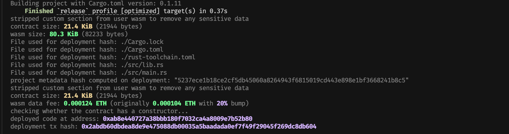

# ERC20 Token Implementation on Arbitrum Stylus

A complete ERC20 token implementation written in Rust for Arbitrum Stylus, featuring owner-controlled minting, self-burning capabilities, and full ERC20 compliance.

## Features

- ✅ **Full ERC20 Compliance**: Implements all standard ERC20 functions
- ✅ **Owner-Controlled Minting**: Only the contract owner can mint new tokens
- ✅ **Self-Burn Mechanism**: Users can burn their own tokens to reduce supply
- ✅ **Gas Optimized**: Leverages Rust and WASM for efficient execution on Arbitrum Stylus
- ✅ **Type-Safe**: Built with Rust's strong type system for enhanced security

## Contract Overview

The contract implements the following ERC20 functionality based on the [OpenZeppelin ERC20 interface](http://github.com/OpenZeppelin/openzeppelin-contracts/blob/master/contracts/token/ERC20/IERC20.sol):

### Core Functions
- `name()`: Returns the token name
- `symbol()`: Returns the token symbol
- `decimals()`: Returns token decimals (fixed at 18)
- `totalSupply()`: Returns current total supply
- `balanceOf(address)`: Returns balance of an address
- `transfer(to, value)`: Transfer tokens to another address
- `approve(spender, value)`: Approve spending allowance
- `allowance(owner, spender)`: Check spending allowance
- `transferFrom(from, to, value)`: Transfer on behalf of another address

### Additional Functions
- `mint(to, value)`: Mint new tokens (owner only)
- `burn(value)`: Burn tokens from caller's balance

## Quick Start

### Prerequisites

Install Rust and the Stylus CLI:

```bash
# Install Rust
curl --proto '=https' --tlsv1.2 -sSf https://sh.rustup.rs | sh

# Install Stylus CLI
cargo install --force cargo-stylus cargo-stylus-check

# Add WASM target
rustup target add wasm32-unknown-unknown
```

### Installation

Clone the repository:

```bash
git clone <your-repo-url>
cd erc20-stylus
```

### Build & Test

```bash
# Run tests
cargo test

# Build for release
cargo build --release --target wasm32-unknown-unknown

# Check deployment readiness
cargo stylus check
```

### Deploy

```bash
# Export ABI
cargo stylus export-abi > abi/erc20.json

# Deploy to Arbitrum Stylus testnet with constructor arguments
cargo stylus deploy --no-verify --private-key <YOUR_PRIVATE_KEY> --constructor-args "MyToken" "MTK"

# Example deployed contract
# Address: 0xab8e440727a38bbb180f7032ca4a8009e7b52b80
```

### Deployment Results



Successfully deployed to Arbitrum Stylus Local Node at address: `0xab8e440727a38bbb180f7032ca4a8009e7b52b80`

## Usage Examples

### Deploying and Interacting

```rust
// Deploy with name and symbol
let token = ERC20::new("MyToken", "MTK");

// Owner mints tokens
token.mint(user_address, 1000000);

// User transfers tokens
token.transfer(recipient, 500);

// User burns tokens
token.burn(100);

// Check balance
let balance = token.balanceOf(user_address);
```

### Integration Example

```javascript
// Using ethers.js
const token = new ethers.Contract(address, abi, signer);

// Read token info
const name = await token.name();
const symbol = await token.symbol();
const supply = await token.totalSupply();

// Transfer tokens
await token.transfer(recipient, ethers.parseEther("100"));

// Approve and transferFrom
await token.approve(spender, ethers.parseEther("50"));
await token.connect(spenderSigner).transferFrom(owner, recipient, amount);
```

## Security Features

1. **Owner-Only Minting**: Prevents unauthorized token creation
2. **Self-Burn Only**: Users can only burn their own tokens
3. **Overflow Protection**: Built-in Rust safety prevents integer overflows
4. **Zero Address Checks**: Validates against zero address operations
5. **Allowance Management**: Proper deduction of allowances in transferFrom

## Contract Architecture

```
ERC20 Contract
├── Storage Layer (sol_storage!)
│   ├── owner: address
│   ├── total_supply: uint256
│   ├── name: string
│   ├── symbol: string
│   ├── decimals: uint8
│   ├── balances: mapping(address => uint256)
│   └── allowances: mapping(address => mapping(address => uint256))
│
├── Internal Functions
│   ├── _update(): Core transfer logic with mint/burn
│   ├── _transfer(): Validated transfers
│   ├── _approve(): Set allowances
│   ├── _spend_allowance(): Consume allowances
│   ├── _mint(): Create tokens
│   └── _burn(): Destroy tokens
│
└── Public Interface (#[public])
    ├── Standard ERC20 functions
    └── Extended functionality (mint, burn)
```

## Testing

The contract includes comprehensive test coverage:

```bash
# Run all tests
cargo test

# Run with output
cargo test -- --nocapture

# Run specific test
cargo test test_burn_functionality
```

### Test Results


All tests pass successfully, validating:
- Token initialization and metadata
- Owner-controlled minting
- Balance tracking and total supply updates
- Self-burn functionality
- Error handling for insufficient balances

## Gas Optimization

- Uses Stylus SDK's efficient storage patterns
- Optimized WASM compilation with release profile
- Minimal storage operations in transfer logic

## Development

### Project Structure
```
erc20-stylus/
├── src/
│   ├── lib.rs          # Main contract implementation
│   └── main.rs         # Entry point for ABI export
├── abi/
│   └── erc20.json      # Generated contract ABI
├── Cargo.toml          # Rust dependencies
└── README.md           # This file
```

### Environment Variables

Create a `.env` file:

```
RPC_URL=https://sepolia-rollup.arbitrum.io/rpc
PRIVATE_KEY_PATH=./private_key.txt
CONTRACT_ADDRESS=<deployed_address>
```

## Testnet Information

Deploy to Arbitrum Stylus testnet:
- RPC: https://sepolia-rollup.arbitrum.io/rpc
- Chain ID: 421614
- Explorer: https://sepolia-rollup.arbiscan.io/
- Faucet: https://www.alchemy.com/faucets/arbitrum-sepolia

## License

This project is dual-licensed under MIT OR Apache-2.0.

## Contributing

Contributions are welcome! Please feel free to submit a Pull Request.

## Acknowledgments

Built with [Arbitrum Stylus SDK](https://github.com/OffchainLabs/stylus-sdk-rs) for efficient WASM smart contracts on Arbitrum.